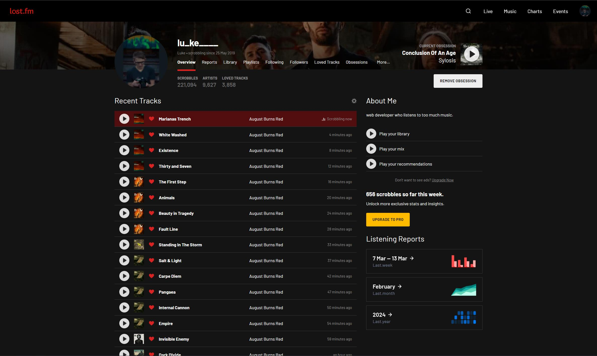
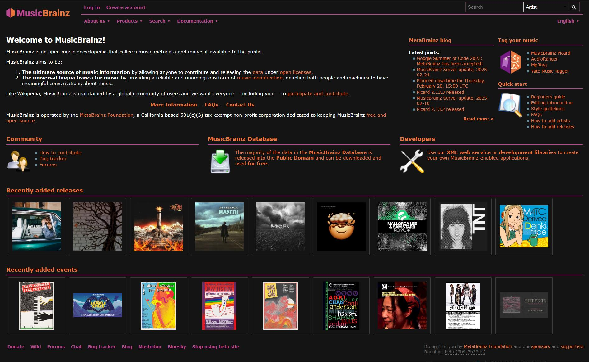
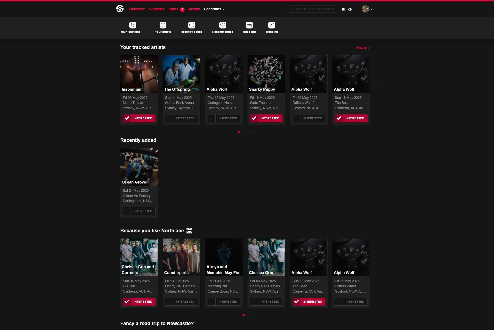

<!-- PROJECT LOGO -->
 

  

<h3 align="center">userstyles</h3>
  

    Custom CSS themes for websites
     
    (mainly adding dark mode to really bright sites)
     
     
    <a href="https://userstyles.world/user/lukethacoder">View Userstyles Profile</a>
    ·
    <a href="https://github.com/lukethacoder/userstyles/issues">Report Bug</a>
    ·
    <a href="https://github.com/lukethacoder/userstyles/issues">Request Website</a>
  

## Introduction

All themes are available directly through the [Stylus](https://add0n.com/stylus.html) Browser Extension ([Chrome](https://chromewebstore.google.com/detail/stylus/clngdbkpkpeebahjckkjfobafhncgmne)/[Firefox](https://addons.mozilla.org/en-US/firefox/addon/styl-us/)), but any CSS theming extension should work with the themes in this repo.

Styles are kept in this repo for issue tracking and any version changes.

## Themes

|                                            |                                                       |
| ------------------------------------------ | ----------------------------------------------------- |
|         |            |
| [Last.fm Dark Mode](./sites/last.fm)       | [musicbrainz.org Dark Mode](./sites/musicbrainz.org/) |
|    |                                                       |
| [Songkick Dark Mode](./sites/songkick.com) |                                                       |
